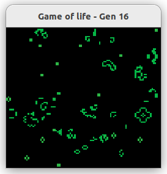

# High_performance_computing 💻

This is a small collection of programs written in C for the class of High Performance Computing in the 5th Semester at the DHBW.

### Game of Life 🦠
A simple game of life simulation, written in C / Glut with parallelization `#pragma omp parallel for collapse(2)`

